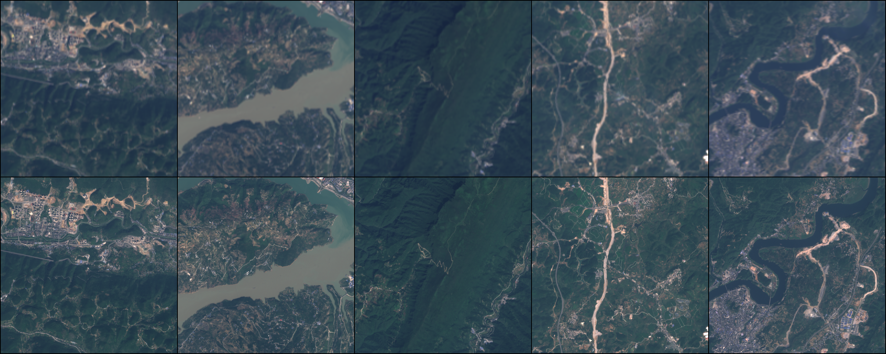

# OLI2MSI

OLI2MSI is a multisensor dataset for remote sensing imagery super-resolution. The OLI2MSI dataset is composed of Landsat8-OLI
and Sentinel2-MSI images, where OLI images serve as low-resolution (LR) images and MSI images are regarded as ground truth 
high-resolution (HR) images. The OLI and MSI data have 10m and 30m ground sample distance (GSD) respectively, which means that 
the dataset has an upscale factor of 3. More details about OLI2MSI can be found in our paper.

---

LR-HR image-pair samples in OLI2MSI training set. The first row is LR images from Landsat8-OLI, while the second row is the
corresponding HR images from Sentinel2-MSI.

## Getting Started
### Download OLI2MSI dataset

All data is hosted on [Baidu Wangpan with extract code: rssr](https://pan.baidu.com/s/1bZMOIEvPKhE2kP9qlkZ33A) and [Google Drive](https://drive.google.com/drive/folders/1kMi-_hSwO3e_Qf68VgLwaaXTNseXxg-d?usp=sharing):

| Path | Size | Files | Format | Description
| :--- | :--: | ----: | :----: | :----------
| OLI2MSI-dataset | 7.5 GB | 10,650 | | Main folder
| &boxvr;&nbsp; train_hr | 6.0 GB | 5,225 | GeoTiff | Aligned and cropped HR images at 480×480 for training
| &boxvr;&nbsp; train_lr | 1.4 GB | 5,225 | GeoTiff | Aligned and cropped HR images at 160×160 for training
| &boxvr;&nbsp; test_hr | 115.2 MB | 100 | GeoTiff | Aligned and cropped HR images at 480×480 for testing
| &boxvr;&nbsp; test_lr | 26.7 MB | 100 | GeoTiff | Aligned and cropped HR images at 160×160 for testing

**Note**: All files are in GeoTiff format. GeoTIFF is a public domain metadata standard which allows georeferencing information to be embedded within a TIFF file. The potential additional information includes map projection, coordinate systems, ellipsoids, datums, and everything else necessary to establish the exact spatial reference for the file. We recommend using [rasterio](https://github.com/mapbox/rasterio) to read the files. Also, you can run 'convertpng.py' to convert the GeoTiff files to png files with the georeferencing information lost.

### Reproduce or make your own dataset
You can also reproduce or make your own dataset in your custom region of interest (ROI) with the provided python scripts.
#### Prerequisites
- Linux or Windows
- Python 3
#### Installation and user guide
- Clone this repo.
- Install the required python packages, the recommended way is to use Conda and create a new conda virtual environment.
- You can use 'download_l8_data.py' and 'download_s2_data.py' to download any independent Landsat8-OLI (L8) tiles and Sentinel2-MSI (S2) granules respectively, or run the 'download_matched_landast8_sentinel2_data.py' to download L8 and S2 data with overlap simultaneously. 
- After downloading matched L8 and S2 data, you can run 'extract_subimgs_from_granules.py' to extract HR sub-images and the corresponding LR sub-images from the whole data tiles/granules. L8 data and S2 data would be reprojected and aligned automatically.
- Once the HR and LR sub-images generated, run 'random_devide_dataset.py' to devide them into training set and testset.
- Run 'convertpng.py' to convert the GeoTiff files to png files if needed.

**Note**:  You neet to create your own geojson file to desigate the ROI first and modify the configurations in scripts as your need. 

Please enjoy it!
## Citation
If you use this code or the OLI2MSI dataset for your research, please cite our paper.
```
@article{wang2021multisensor,
  title={Multisensor Remote Sensing Imagery Super-Resolution with Conditional GAN},
  author={Wang, Junwei and Gao, Kun and Zhang, Zhenzhou and Ni, Chong and Hu, Zibo and Chen, Dayu and Wu, Qiong},
  journal={Journal of Remote Sensing},
  volume={2021},
  year={2021},
  publisher={AAAS}
}

```
